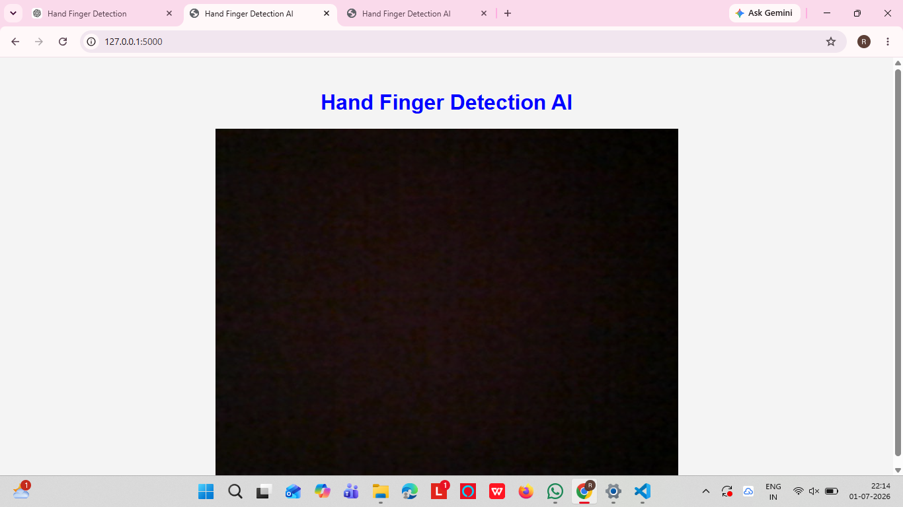
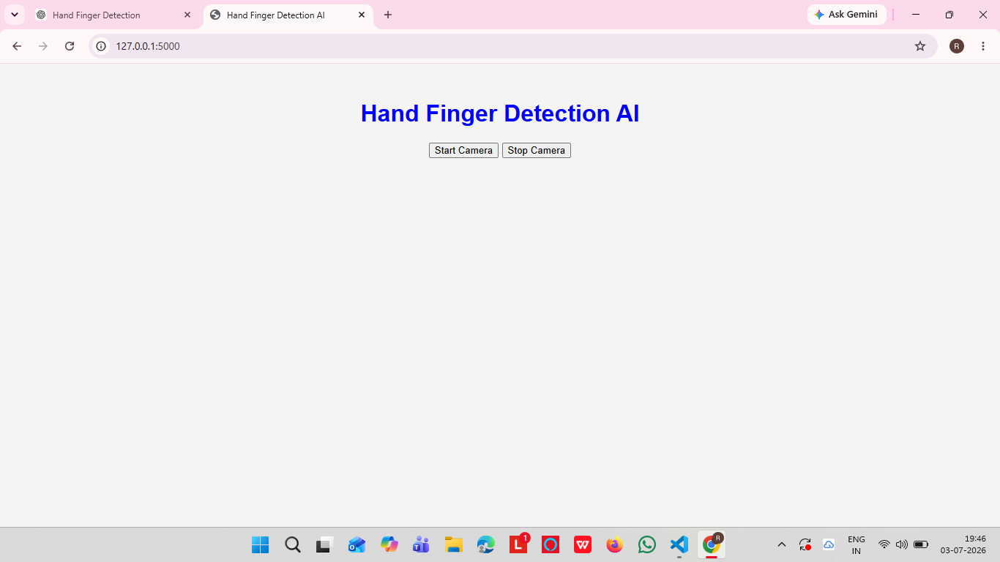
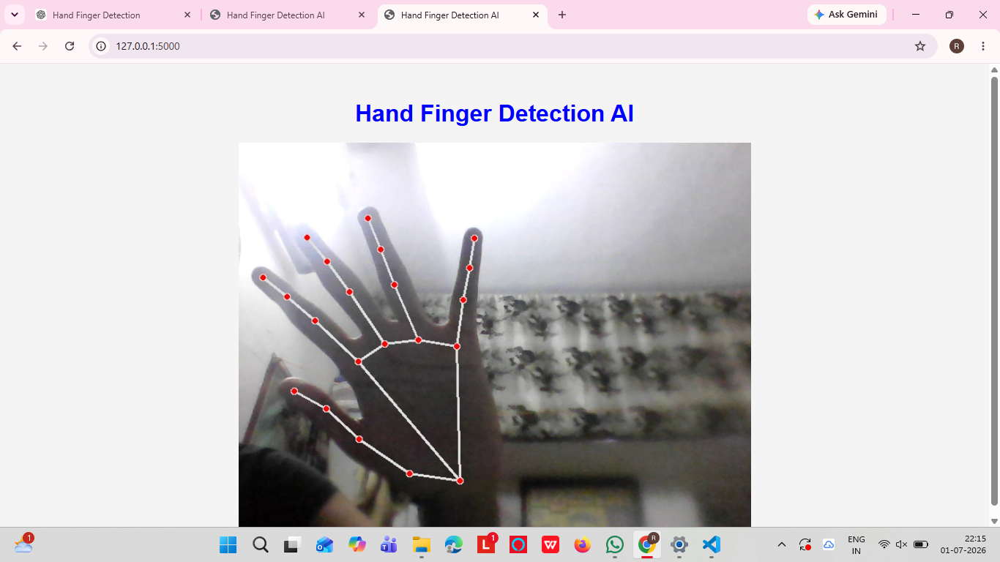
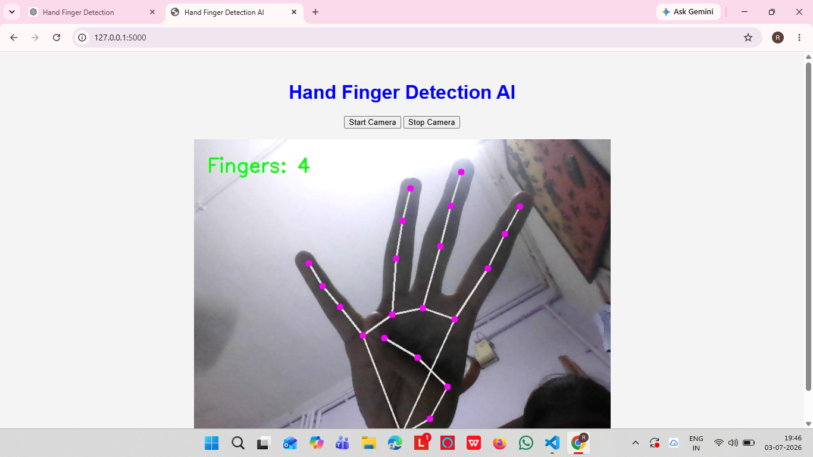

# 🖐️ Hand Finger Detection AI

A real-time **Hand Finger Detection** web application built using **Python**, **OpenCV**, **MediaPipe**, and **Flask**. This application detects a user's hand through a webcam, tracks **21 hand landmarks**, counts the number of fingers raised in real time, and provides **Start Camera** and **Stop Camera** controls through a user-friendly web interface.

---

## 📌 Features

- 🎥 Real-time webcam streaming
- ✋ Real-time hand detection
- 🖐️ 21 hand landmark detection using MediaPipe
- 🔢 Real-time finger counting
- ▶️ Start Camera button
- ⏹️ Stop Camera button
- 🌐 Flask backend
- 🎨 HTML, CSS & JavaScript frontend
- 📺 Live video streaming in the browser
- ⚡ Fast and lightweight AI-powered hand tracking

---

## 🛠️ Technologies Used

- Python
- Flask
- OpenCV
- MediaPipe
- HTML5
- CSS3
- JavaScript
- Git
- GitHub

---

## 📁 Project Structure

```text
HandFingerDetectionAI/
│
├── app.py
├── detector.py
├── HandTrackingModule.py
├── main.py
├── requirements.txt
├── README.md
├── .gitignore
│
├── templates/
│   └── index.html
│
├── static/
│   ├── css/
│   │   └── style.css
│   └── js/
│       └── script.js
│
├── screenshots/
│   ├── FingerCounter.png
│   ├── HandDetection.png
│   ├── Home.png
│   └── StartStop.png
│
└── venv/
```

---

## 🚀 Installation

### 1. Clone the Repository

```bash
git clone https://github.com/rakshidasri18-sketch/HandFingerDetectionAI.git
```

### 2. Navigate to the Project Folder

```bash
cd HandFingerDetectionAI
```

### 3. Create a Virtual Environment

```bash
python -m venv venv
```

### 4. Activate the Virtual Environment

**Windows**

```bash
venv\Scripts\activate
```

**macOS / Linux**

```bash
source venv/bin/activate
```

### 5. Install the Required Packages

```bash
pip install -r requirements.txt
```

### 6. Run the Application

```bash
python app.py
```

### 7. Open Your Browser

```
http://127.0.0.1:5000
```

---

## 📷 Project Screenshots

### 🏠 Home Page



---

### ▶️ Start & Stop Camera



---

### ✋ Hand Detection



---

### 🔢 Finger Counter



---

## 💡 How It Works

1. Open the application in your browser.
2. Click the **Start Camera** button.
3. Allow webcam access if prompted.
4. The application detects your hand using **MediaPipe**.
5. It tracks **21 hand landmarks** in real time.
6. The application counts the number of fingers raised and displays the count.
7. Click the **Stop Camera** button to stop the webcam stream.

---

## 🎯 Future Enhancements

- ✌️ Hand Gesture Recognition
- 🖱️ Virtual Mouse Control
- 🔊 Volume Control using Hand Gestures
- 💡 Brightness Control using Hand Gestures
- 📸 Screenshot Capture Feature
- 🤚 Left & Right Hand Recognition
- 🌙 Dark Mode
- 📱 Responsive UI for Mobile Devices
- 👤 User Authentication
- 🗄️ Database Integration
- ☁️ Cloud Deployment (Render/Railway)

---

## 👩‍💻 Author

**B. S. Rakshida Sri**

**GitHub:**  
https://github.com/rakshidasri18-sketch

**LinkedIn:**  
https://www.linkedin.com/in/Rakshida sri/

---

## ⭐ Support

If you found this project helpful, please consider giving it a **⭐ Star** on GitHub.

---

## 🙏 Acknowledgements

- Google MediaPipe
- OpenCV
- Flask
- Python Community